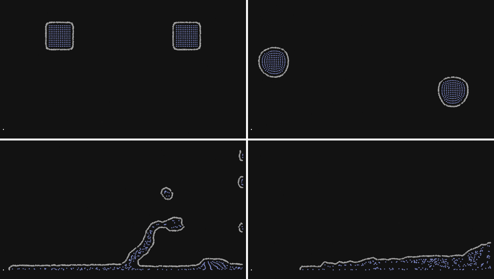
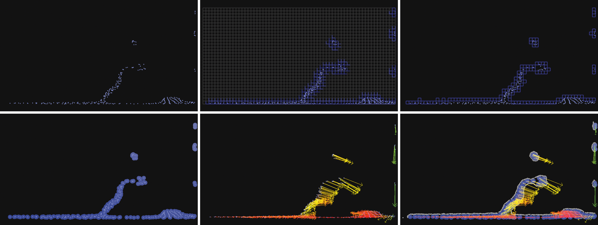
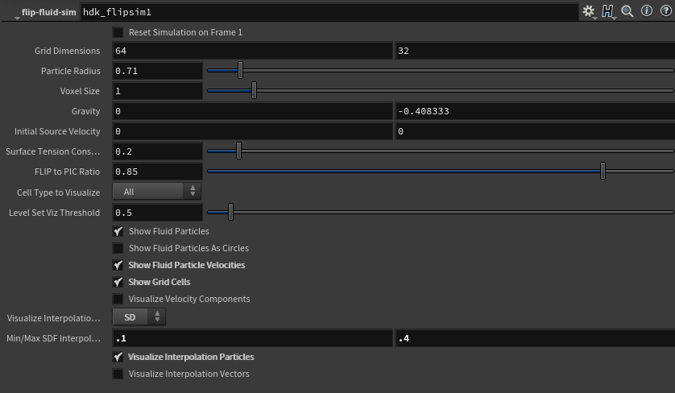

# flip-fluid-sim
A simple, interactive 2D FLIP fluid simulator based on Bridson's "Fluid Simulation for Computer Graphics" book written for Houdini. The intention of this simulator is to provide a clean foundation for experimenting and implementing new FLIP-based fluid simulation features either for research or whatever your application may be.

This simulator supports interactively manipulating parameters such as gravity and surface tension. A number of visualization options are also provided. Some of these visualizations are shown below:

To use the simulator, first install SideFX Houdini (it was initially implemented for version 16.5), then build the code using the instructions in the provided makefile, and then import the node in a SOP context. You can then manipulate the parameters shown below, or even provide a source geometry as an input which will birth new fluid particles into the simulation.

